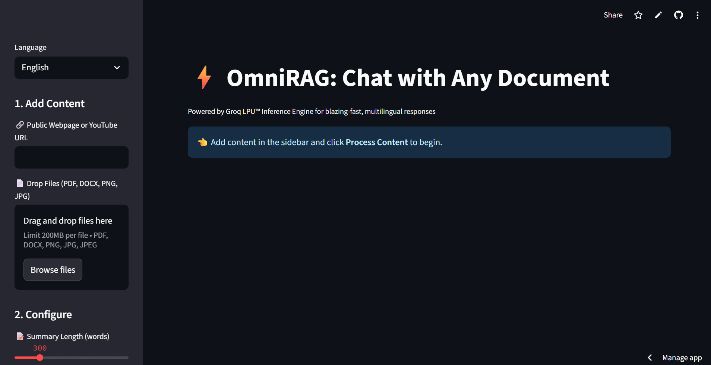

# ⚡ OmniRAG: Multilingual AI Document Assistant

[](https://genai-omnirag.streamlit.app/)
[](https://www.python.org/downloads/)

> **Chat with any document in multiple languages** — Upload PDFs, images, web pages, or YouTube videos and get instant AI-powered insights with multilingual support.

---

## 📸 View App(Click to Launch)

[](https://genai-omnirag.streamlit.app/)

---

## 🌟 Features

- 📄 **Multi-format Support**: PDF, DOCX, Images (PNG, JPG), Web URLs, YouTube videos
- 🌍 **Multilingual**: English, Spanish, Hindi, Telugu, Tamil
- 🔊 **Text-to-Speech**: Hear summaries in your preferred language
- 💬 **Interactive Chat**: RAG-powered conversations with your documents
- 📊 **Smart Summarization**: Adjustable summary length with Markdown formatting
- 📥 **Export Options**: Download reports as DOCX or JSON
- ⚡ **Lightning Fast**: Powered by Groq LPU™ inference engine
- 🔍 **OCR Support**: Extract text from images using Tesseract

---

## 🚀 Quick Start

### Prerequisites

- Python 3.8 or higher
- Tesseract OCR installed
- Groq API key

### Installation

```bash
git clone https://github.com/yajnavalkya28/GenAI-OmniRag.git
cd GenAI-OmniRag
pip install -r requirements.txt
```

Install Tesseract:

- **Ubuntu/Debian:**
  ```bash
  sudo apt-get install tesseract-ocr tesseract-ocr-eng libtesseract-dev
  ```
- **macOS:**
  ```bash
  brew install tesseract
  ```
- **Windows:**  
  Download from [Tesseract releases](https://github.com/UB-Mannheim/tesseract/wiki)

### Set Environment Variable

Create `.streamlit/secrets.toml`:

```toml
GROQ_API_KEY = "your_groq_api_key_here"
```

Or export manually:

```bash
export GROQ_API_KEY="your_groq_api_key_here"
```

### Run the App

```bash
streamlit run app.py
```

---

## 🎯 Usage Guide

1. **Upload** PDF, DOCX, image, YouTube link, or URL
2. **Choose Language & Summary Length**
3. **Process & Chat** with your content
4. **Download Results** (DOCX/JSON)

---

## 🛠️ Technical Architecture

- **Document Handling**: OCR + file loaders
- **Embeddings**: `all-MiniLM-L6-v2` (HuggingFace)
- **Vector Store**: FAISS
- **LLM**: Groq (LLaMA 3 8B)
- **TTS**: Google gTTS
- **Multilingual Translation**: Built-in

### Supported Languages

| Language | Code | UI | TTS |
|----------|------|----|-----|
| English  | en   | ✅ | ✅  |
| Spanish  | es   | ✅ | ✅  |
| Hindi    | hi   | ✅ | ✅  |
| Telugu   | te   | ✅ | ✅  |
| Tamil    | ta   | ✅ | ✅  |

---

## 📦 Requirements

### Python Libraries

```
streamlit
langchain
langchain-groq
langchain-community
langchain-huggingface
faiss-cpu
pypdf
python-docx
youtube-transcript-api
pillow
pytesseract
beautifulsoup4
requests
sentence-transformers
gTTS
Markdown
```

### System Packages

```
tesseract-ocr
tesseract-ocr-eng
libtesseract-dev
```

---

## 🧰 Configuration

**Custom Theme:** `.streamlit/config.toml`

```toml
[theme]
primaryColor = "#FF6B6B"
backgroundColor = "#FFFFFF"
secondaryBackgroundColor = "#F0F2F6"
textColor = "#262730"

[server]
maxUploadSize = 200
```

---

## ☁️ Deployment

### Streamlit Cloud

1. Fork repo → Connect to [Streamlit Cloud](https://streamlit.io/cloud)
2. Add `GROQ_API_KEY` in app settings

### Docker

```dockerfile
FROM python:3.9-slim

RUN apt-get update && apt-get install -y \
    tesseract-ocr tesseract-ocr-eng libtesseract-dev \
    && rm -rf /var/lib/apt/lists/*

WORKDIR /app
COPY requirements.txt .
RUN pip install -r requirements.txt

COPY . .

EXPOSE 8501

CMD ["streamlit", "run", "app.py", "--server.port=8501", "--server.address=0.0.0.0"]
```

---

## 🤝 Contributing

```bash
git checkout -b feature/feature-name
# make changes
git commit -m "Add: feature"
git push origin feature/feature-name
```

Then open a Pull Request.

---

## 🙏 Acknowledgments

- **Groq** for LPU Inference
- **LangChain** for RAG
- **Streamlit** for UI
- **Tesseract** for OCR
- **HuggingFace** for embeddings

---

## 🧭 Roadmap

- [ ] Add more languages
- [ ] Audio file support
- [ ] Cloud integration
- [ ] Auth & user accounts
- [ ] Collaborative chat on docs

---

## 📬 Support

- [🐞 Bug Reports](https://github.com/yajnavalkya28/GenAI-OmniRag/issues)
- 📧 [yajnavalkyamaddi2006@gmail.com](mailto:yajnavalkyamaddi2006@gmail.com)

---

<div align="center">
  <strong>Made with ❤️ by Yajnavalkya</strong>
</div>
